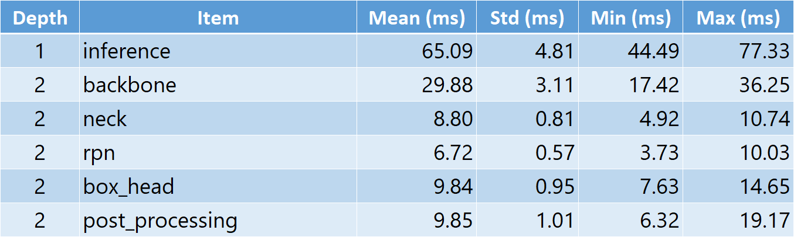

# nntime - Simple Utilities for Timing Artificial Neural Networks

Want to time some of your deep learning code, but find general-purpose profilers hard to work with? Then you are here at the right place!

<p align="center"></p>


- Offers an easy way to manually mark and time only relevant code
- Auto exports all timings to a table (CSV file)
- Timer markers can optionally include semantic call depths (not actual but uninterpretable ones) and the output will be organized by these call depths
- Works with CPU/GPU
- Introduces negligible overhead
- (New in 0.1.1) Recursively times all submodules with automatic depth markers

Check out the `examples` folder for usage.

## Installation

[](https://badge.fury.io/py/nntime)

Install [PyTorch](https://pytorch.org/) and run:
```
pip install nntime
```
